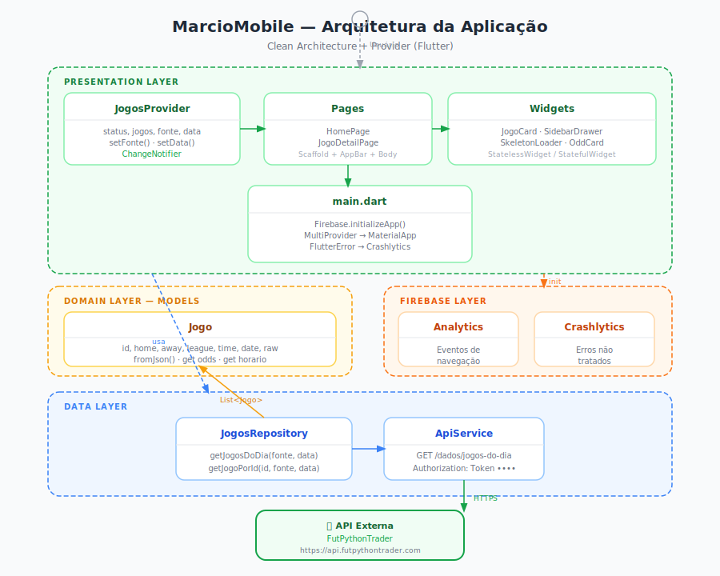

<div align="center">
  <h1>⚽ MarcioMobile</h1>
  <p>Aplicativo Flutter para visualização de odds e jogos de futebol do dia, consumindo a API <strong>FutPythonTrader</strong>.</p>
  <p>Versão mobile do projeto <a href="https://github.com/seu-usuario/marcioweb">MarcioWeb</a> (Next.js).</p>

  
  &nbsp;&nbsp;
  
  &nbsp;&nbsp;
  
</div>

---

## Sumário

- [Sobre o Projeto](#sobre-o-projeto)
- [Funcionalidades](#funcionalidades)
- [Tecnologias](#tecnologias)
- [Arquitetura](#arquitetura)
- [Pré-requisitos](#pré-requisitos)
- [Instalação e Execução](#instalação-e-execução)
- [Configuração do Firebase](#configuração-do-firebase)
- [Estrutura de Pastas](#estrutura-de-pastas)
- [Screenshots](#screenshots)

---

## Sobre o Projeto

**MarcioMobile** é a versão Flutter do **MarcioWeb**, mantendo a mesma proposta: listar os jogos do dia com informações de odds provenientes de diferentes fontes (FootyStats, BetFair e Bet365), permitindo ao usuário filtrar por fonte e data, e visualizar detalhes de odds de cada partida.

A API utilizada é a [FutPythonTrader](https://api.futpythontrader.com), autenticada via Token.

---

## Funcionalidades

| Funcionalidade | Descrição |
|---|---|
| 🏠 Jogos do Dia | Lista todos os jogos disponíveis para a data selecionada |
| 🔍 Filtro por Fonte | Alterna entre FootyStats, BetFair e Bet365 |
| 📅 Filtro por Data | Seleciona qualquer data via DatePicker nativo |
| 📊 Detalhes de Odds | Visualiza todas as odds disponíveis para um jogo |
| 🔄 Skeleton Loading | Animação de carregamento enquanto os dados são buscados |
| 🔥 Firebase Analytics | Monitoramento de uso da aplicação |
| 💥 Firebase Crashlytics | Captura e reporte automático de falhas |

---

## Tecnologias

| Tecnologia | Versão | Uso |
|---|---|---|
| [Flutter](https://flutter.dev) | ≥ 3.22 | Framework principal |
| [Dart](https://dart.dev) | ≥ 3.3 | Linguagem |
| [Provider](https://pub.dev/packages/provider) | ^6.1.2 | Gerenciamento de estado |
| [http](https://pub.dev/packages/http) | ^1.2.2 | Requisições HTTP |
| [firebase_core](https://pub.dev/packages/firebase_core) | ^3.13 | Firebase — inicialização |
| [firebase_analytics](https://pub.dev/packages/firebase_analytics) | ^11.4 | Firebase — Analytics |
| [firebase_crashlytics](https://pub.dev/packages/firebase_crashlytics) | ^4.3 | Firebase — Crashlytics |
| [shimmer](https://pub.dev/packages/shimmer) | ^3.0 | Efeito de skeleton loading |
| [intl](https://pub.dev/packages/intl) | ^0.19 | Formatação de datas |

---

## Arquitetura

O projeto segue o padrão **Clean Architecture** com separação em três camadas principais, orquestradas pelo **Provider** para gerenciamento de estado.

> Diagrama completo: [docs/architecture.svg](docs/architecture.svg)

<div align="center">
  
</div>

```
┌─────────────────────────────────────────────────────┐
│                  PRESENTATION LAYER                  │
│                                                      │
│   ┌──────────────┐   ┌──────────────────────────┐   │
│   │    Pages     │   │         Widgets          │   │
│   │  ──────────  │   │  ──────────────────────  │   │
│   │  HomePage    │   │  JogoCard                │   │
│   │  JogoDetail  │   │  SidebarDrawer           │   │
│   └──────┬───────┘   │  SkeletonLoader          │   │
│          │           └──────────────────────────┘   │
│   ┌──────▼───────┐                                   │
│   │  Providers   │   (ChangeNotifier + Provider)     │
│   │  ──────────  │                                   │
│   │  JogosProvider                                   │
│   └──────┬───────┘                                   │
└──────────┼──────────────────────────────────────────┘
           │
┌──────────▼──────────────────────────────────────────┐
│                    DOMAIN LAYER                      │
│                                                      │
│   ┌──────────────────────────┐                      │
│   │         Models           │                      │
│   │  ──────────────────────  │                      │
│   │  Jogo (fromJson, odds)   │                      │
│   └──────────────────────────┘                      │
└─────────────────────────────────────────────────────┘
           │
┌──────────▼──────────────────────────────────────────┐
│                     DATA LAYER                       │
│                                                      │
│   ┌──────────────┐   ┌──────────────────────────┐   │
│   │  Repository  │──▶│       ApiService         │   │
│   │  ──────────  │   │  ──────────────────────  │   │
│   │  JogosRepo   │   │  GET /dados/jogos-do-dia │   │
│   └──────────────┘   │  Token Authorization     │   │
│                       └──────────────────────────┘   │
└─────────────────────────────────────────────────────┘
           │
┌──────────▼──────────────────────────────────────────┐
│                   FIREBASE LAYER                     │
│                                                      │
│   ┌───────────────┐   ┌───────────────────────┐     │
│   │   Analytics   │   │     Crashlytics       │     │
│   │  Eventos de   │   │  Captura erros não    │     │
│   │  navegação    │   │  tratados em produção │     │
│   └───────────────┘   └───────────────────────┘     │
└─────────────────────────────────────────────────────┘
```

### Fluxo de dados

```
Usuário seleciona filtro (fonte/data)
        │
        ▼
JogosProvider.setFonte() / setData()
        │
        ▼
JogosRepository.getJogosDoDia()
        │
        ▼
ApiService.get("dados/jogos-do-dia/{fonte}/{data}")
        │  Token: Authorization header
        ▼
FutPythonTrader API (HTTPS)
        │
        ▼
List<Jogo> (parsed via Jogo.fromJson)
        │
        ▼
Provider notifica UI → rebuild dos widgets
```

---

## Pré-requisitos

- [Flutter SDK](https://docs.flutter.dev/get-started/install) **≥ 3.22**
- [Dart SDK](https://dart.dev/get-dart) **≥ 3.3** (incluso no Flutter)
- [Android Studio](https://developer.android.com/studio) ou [VS Code](https://code.visualstudio.com/) com extensão Flutter
- Conta no [Firebase](https://firebase.google.com/) (para Analytics e Crashlytics)
- [FlutterFire CLI](https://firebase.flutter.dev/docs/cli) para configuração do Firebase

---

## Instalação e Execução

### 1. Clone o repositório

```bash
git clone https://github.com/seu-usuario/marciomobile.git
cd marciomobile
```

### 2. Instale as dependências

```bash
flutter pub get
```

### 3. Configure o Firebase

> Veja a seção [Configuração do Firebase](#configuração-do-firebase) abaixo.

### 4. Execute o projeto

```bash
# Verificar dispositivos disponíveis
flutter devices

# Rodar em dispositivo/emulador Android
flutter run

# Rodar em dispositivo iOS (requer macOS)
flutter run -d ios

# Rodar na web
flutter run -d chrome

# Build de release Android
flutter build apk --release

# Build de release iOS
flutter build ipa --release
```

---

## Configuração do Firebase

O projeto usa **Firebase Analytics** e **Firebase Crashlytics**. Siga os passos:

### 1. Instale o FlutterFire CLI

```bash
dart pub global activate flutterfire_cli
```

### 2. Faça login no Firebase

```bash
firebase login
```

### 3. Configure o projeto

```bash
flutterfire configure
```

Esse comando irá:
- Criar ou vincular um projeto no Firebase Console
- Gerar o arquivo `lib/firebase_options.dart` com as chaves corretas
- Registrar os apps Android, iOS e Web automaticamente

### 4. Android — adicione o plugin do Crashlytics

No arquivo `android/app/build.gradle`, certifique-se de ter:

```gradle
plugins {
    id 'com.google.firebase.crashlytics'
}
```

E no `android/build.gradle`:

```gradle
dependencies {
    classpath 'com.google.firebase:firebase-crashlytics-gradle:2.9.9'
}
```

### 5. iOS — adicione o script do Crashlytics (Xcode)

No Xcode: **Target → Build Phases → + New Run Script Phase**:

```bash
"${PODS_ROOT}/FirebaseCrashlytics/run"
```

> Consulte a [documentação oficial](https://firebase.flutter.dev/docs/crashlytics/overview) para detalhes completos.

---

## Estrutura de Pastas

```
marciomobile/
├── lib/
│   ├── main.dart                          # Entry point + Firebase init + Provider setup
│   ├── firebase_options.dart              # Gerado pelo FlutterFire CLI
│   │
│   ├── core/
│   │   ├── constants/
│   │   │   └── app_constants.dart         # URL da API, token, fontes disponíveis
│   │   └── theme/
│   │       └── app_theme.dart             # Paleta de cores e ThemeData
│   │
│   ├── data/
│   │   ├── models/
│   │   │   └── jogo.dart                  # Model com fromJson e getter de odds
│   │   ├── services/
│   │   │   └── api_service.dart           # HTTP client com autenticação por Token
│   │   └── repositories/
│   │       └── jogos_repository.dart      # Camada de acesso a dados
│   │
│   └── presentation/
│       ├── providers/
│       │   └── jogos_provider.dart        # Estado global (fonte, data, jogos, status)
│       ├── pages/
│       │   ├── home_page.dart             # Listagem dos jogos do dia
│       │   └── jogo_detail_page.dart      # Detalhes e odds de um jogo
│       └── widgets/
│           ├── jogo_card.dart             # Card de cada jogo na listagem
│           ├── sidebar_drawer.dart        # Drawer com filtros de fonte e data
│           └── skeleton_loader.dart       # Animação de loading com shimmer
│
├── pubspec.yaml                           # Dependências do projeto
├── analysis_options.yaml                  # Regras de lint
└── README.md
```

---

## Screenshots

> Adicione os prints reais da aplicação na pasta `docs/screenshots/` após rodar o projeto.

| Home — Jogos do Dia | Drawer — Filtros | Odds do Jogo |
|:---:|:---:|:---:|
|  |  |  |

**Descrição das telas:**

- **Home**: Lista de jogos em cards com badge da liga, times (Casa vs Fora), data/horário e botão "Ver Odds"
- **Drawer de Filtros**: Menu lateral com seleção de fonte (FootyStats, BetFair, Bet365) e DatePicker nativo
- **Odds do Jogo**: Grade 2 colunas com todos os campos de odds disponíveis para a partida

---

## Contribuindo

1. Faça um fork do projeto
2. Crie uma branch para sua feature (`git checkout -b feature/minha-feature`)
3. Commit suas mudanças (`git commit -m 'feat: adiciona minha feature'`)
4. Push para a branch (`git push origin feature/minha-feature`)
5. Abra um Pull Request

---

## Licença

Este projeto está sob a licença MIT. Veja o arquivo [LICENSE](LICENSE) para mais detalhes.
